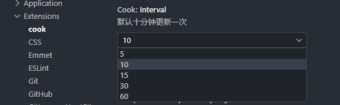

# Choicefe 组件更新通知

#### 默认支持如下组件通知功能 (2020-08-14)

- "@choicefe/scm-widgets"
- "@choicefe/scm-permission"
- "@choicefe/scm-components"
- "@choicefe/scm-modal"
- "@choicefe/scm-utils"
- "@choicefe/scm-common"
- "@choicefe/scm-constant"

#### 支持自定义配置 (2020-08-21)

> 1. 默认 10 分钟同步一次



> 2. 扩展组件配置

```json
{
  "cook.component.names": ["@choicefe/picker", "@choicefe/select"]
}
```

#### 状态栏信息反馈


#### 快捷键 Windows: ctrl+q+q; Mac cmd+q+q;
